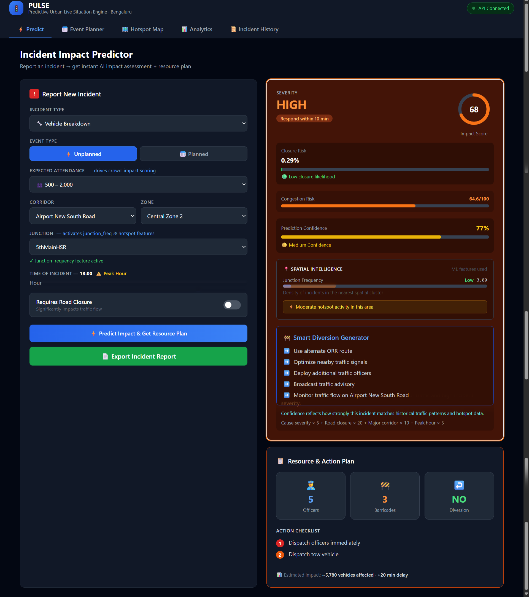

# PULSE — Predictive Urban Live Situation Engine

> **Flipkart Gridlock Hackathon 2026 · Event-Driven Congestion (Planned & Unplanned)**
>
> An AI-powered traffic intelligence platform for Bengaluru that predicts incident impact,
> recommends officer and barricade deployment, and generates smart diversion plans —
> before congestion cascades across the city.

---

## 🚀 Live Deployment

| | Link |
|---|---|
| **Frontend (Dashboard)** | https://pulse-alpha-two.vercel.app/ |
| **Backend (API)** | https://flipkart-grid-30ud.onrender.com |
| **API Docs (Swagger)** | https://flipkart-grid-30ud.onrender.com/docs |

---

## Live Dashboard


*PULSE live dashboard showing the Incident Impact Predictor: a Vehicle Breakdown on Airport New South Road at peak hour (18:00) returns HIGH severity, impact score 68, congestion risk 64.6/100, 77% prediction confidence, Smart Diversion recommendations, and a Resource & Action Plan of 5 officers + 3 barricades.*

---

## What is PULSE?

PULSE is a full-stack, ML-powered traffic management system trained on 8,173 real anonymised incidents from Bengaluru's ASTRAM monitoring network. It gives traffic operators a 5–30 minute head start on resource deployment by predicting incident severity, closure risk, and downstream congestion the moment an incident is reported — not after it has already spread.

---

## The Problem We Solve

Political rallies, cricket matches, festivals, construction, and sudden accidents create localised traffic breakdowns every single day across Bengaluru. Three gaps exist in how the city manages them today:

- **Event impact is not quantified in advance** — response teams deploy on gut feel
- **Resource deployment is experience-driven** — no data-backed officer or barricade allocation
- **No post-event learning system** — the same corridors get overwhelmed repeatedly

PULSE closes all three gaps.

---

## Key Numbers

| Metric | Value |
|---|---|
| Training records | 8,173 ASTRAM incidents |
| Corridors monitored | 22 major Bengaluru corridors |
| Junctions indexed | 294 |
| Hotspot clusters | 92 (K-Means on real GPS data) |
| Road closure model AUC | 0.7507 |
| Cause classifier accuracy | 71% (11-class problem) |
| Prediction latency | < 10 ms |

---

## Features

### Incident Impact Predictor
Report any incident and get an instant AI assessment — impact score (0–100), severity band (CRITICAL/HIGH/MEDIUM/LOW), congestion risk, road closure probability, and a 5–30 minute response SLA.

### Resource & Action Plan
Exact officer count, barricade count, and diversion flag for every prediction. Backed by a cause-specific resource table built from historical dispatch data.

### Smart Diversion Generator
When road closure is predicted or toggled on, PULSE auto-generates corridor-specific alternate route recommendations so dispatchers don't have to think from scratch.

### Spatial Intelligence Engine
Every prediction is enriched with junction frequency, corridor frequency, and hotspot cluster density — three spatial features that make location-aware predictions possible.

### Hotspot Map
Interactive Leaflet map showing all 92 cluster centroids across Bengaluru, colour-coded by risk level. Live predictions pin to the map in real time.

### Analytics Dashboard
Hourly incident distribution, top corridors by risk, cause breakdown with average impact, and top high-frequency junctions — all from the ASTRAM dataset.

### Event Planner
Pre-register planned events (festivals, rallies, sports matches) and get a resource deployment plan in advance, before the event happens.

---

## Tech Stack

| Layer | Technology |
|---|---|
| Backend | Python 3.11 + FastAPI |
| ML Models | LightGBM 4.3 + scikit-learn |
| Frontend | React 18 + Vite 5 |
| Styling | Tailwind CSS 3.4 |
| Maps | Leaflet + React-Leaflet |
| Charts | Recharts 2.12 |
| HTTP | Axios 1.7 |
| Data | ASTRAM Bengaluru (anonymised) |

---

## Project Structure

```
Flipkart_Grid/
├── Astram event data_anonymized.csv    Training dataset (8,173 records)
├── final_training_model.py             ML pipeline (top-level copy)
│
└── PULSE/
    ├── backend/
    │   ├── main.py                     FastAPI app + all API endpoints
    │   ├── predictor.py                ML inference engine (315 lines)
    │   ├── requirements.txt            Python dependencies
    │   └── models/                     All serialised ML artifacts
    │       ├── closure_model.pkl
    │       ├── cause_model.pkl
    │       ├── encoders.pkl
    │       ├── junction_freq_map.pkl
    │       ├── corridor_freq_map.pkl
    │       ├── cluster_centers.pkl
    │       ├── cluster_density_map.pkl
    │       ├── cause_severity.pkl
    │       ├── hotspots.json
    │       ├── resource_table.json
    │       └── feature_importance.json
    │
    ├── frontend/
    │   ├── index.html
    │   ├── package.json
    │   ├── vite.config.js
    │   ├── tailwind.config.js
    │   └── src/
    │       ├── App.jsx
    │       ├── main.jsx
    │       ├── index.css
    │       └── components/
    │           ├── IncidentForm.jsx
    │           ├── ResultCard.jsx
    │           ├── ResourcePanel.jsx
    │           ├── Map.jsx
    │           └── Analytics.jsx
    │
    └── ml/
        └── final_training_model.py     Complete ML training pipeline (1,087 lines)
```

---

## Setup & Installation

> **The project runs both on the live deployed links and locally on your machine.**

---

### Option A — Use the Live Deployed Version (no setup needed)

| | Link |
|---|---|
| Frontend | https://pulse-alpha-two.vercel.app/ |
| Backend API | https://flipkart-grid-30ud.onrender.com |
| API Docs | https://flipkart-grid-30ud.onrender.com/docs |

Open the frontend link and everything works out of the box — no installation required.

---

### Option B — Run Locally

#### Prerequisites
- Python 3.10+
- Node.js 18+
- The ASTRAM dataset CSV in the project root

#### Step 1 — Train the ML Models *(run once)*

Skip if `PULSE/backend/models/` already has the `.pkl` files.

```bash
cd Flipkart_Grid
pip install pandas numpy scikit-learn lightgbm joblib
python final_training_model.py
```

#### Step 2 — Start the Backend

```bash
cd PULSE/backend
python -m venv venv
source venv/bin/activate          # Windows: venv\Scripts\activate
pip install -r requirements.txt
uvicorn main:app --reload --host 0.0.0.0 --port 8000
```

Backend runs at `http://localhost:8000`
API Docs at `http://localhost:8000/docs`

#### Step 3 — Start the Frontend

```bash
cd PULSE/frontend
npm install
npm run dev
```

Frontend runs at `http://localhost:5173`

---

## API Reference

| Method | Endpoint | Description |
|---|---|---|
| `GET` | `/health` | Health check — confirms backend is live |
| `POST` | `/predict` | Main prediction — returns full impact report + resource plan |
| `GET` | `/hotspots` | All 92 hotspot cluster centroids for the Leaflet map |
| `GET` | `/analytics` | Pre-computed stats: corridors, causes, hourly distribution |
| `GET` | `/corridors` | List of all 22 monitored corridors |
| `GET` | `/zones` | List of all 11 city zones |

---

## Impact Score Formula

```
Impact Score  = (cause_severity × 5) + (road_closure × 20) + (is_major_corridor × 10) + (is_peak_hour × 5)
                Clamped to [0, 100]

Congestion Risk = (0.4 × impact) + (20 × is_peak) + (15 × is_major) + (10 × closure_flag)
                  Clamped to [0, 100]
```

**Severity response SLAs:**
- CRITICAL (≥ 75) → respond within 5 minutes
- HIGH (≥ 50) → respond within 10 minutes
- MEDIUM (≥ 25) → respond within 20 minutes
- LOW (< 25) → respond within 30 minutes

---

## Troubleshooting

| Problem | Fix |
|---|---|
| **Live site not loading** | Visit https://pulse-alpha-two.vercel.app/ directly. Clear browser cache if needed. |
| **API Offline badge (live)** | Backend is live at https://flipkart-grid-30ud.onrender.com — may take 30–60 seconds to wake up on Render free tier. |
| **API Offline badge (local)** | Backend not running locally — follow Option B Step 2 above. Ensure port 8000 is free. |
| **CORS error (local)** | Make sure the local backend is running on port 8000 exactly. |
| **ModuleNotFoundError (local)** | Run `pip install -r requirements.txt` inside `PULSE/backend`. |
| **Model files missing (local)** | Run `python final_training_model.py` first (Step 1). |
| **Map not loading** | Leaflet CSS loads from CDN — check your internet connection and refresh. |
| **npm install fails** | Use Node.js 18 or higher — check with `node --version`. |

---

*PULSE — Built for Bengaluru. Built for real.*
*Flipkart Gridlock Hackathon 2026 | Event-Driven Congestion Track*
